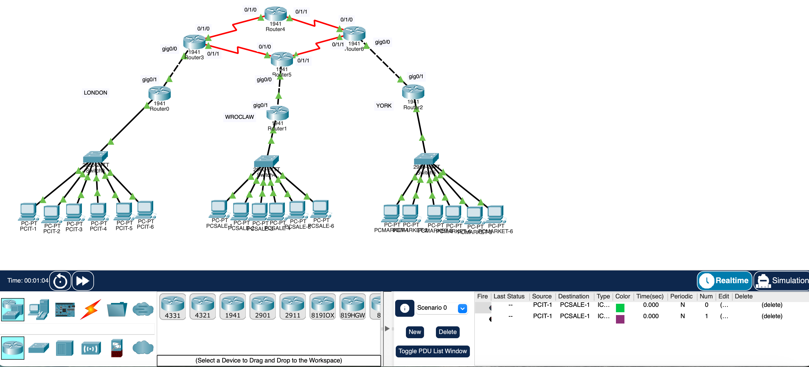

# Cisco Packet Tracer – Multi-Site Network Topology

## Network Topology

This project demonstrates the design and configuration of a multi-site enterprise network using Cisco Packet Tracer.

The topology simulates three geographically separated offices connected through a routed WAN backbone.

## Network Sites

The network consists of three branch locations:

- London
- Wroclaw
- York

Each site includes a Local Area Network (LAN) with multiple client computers connected through a switch to a local router.

## Devices Used

### Routers
- Router0 – London gateway router
- Router1 – Wroclaw gateway router
- Router2 – York gateway router
- Router3 – Core router
- Router4 – Core router
- Router5 – Core router
- Router6 – Core router

### Switches
- 3 access switches (one per site)

### End Devices
- 18 PCs total

**London LAN**
- PCIT-1 to PCIT-6

**Wroclaw LAN**
- PCSALE-1 to PCSALE-6

**York LAN**
- PCMARKET-1 to PCMARKET-6

## Network Architecture

Each branch follows this structure:

The WAN backbone consists of interconnected routers (Router3, Router4, Router5, Router6), enabling communication among the branch offices.

## Key Concepts Demonstrated

- Multi-site network design
- Router-to-router WAN connections
- LAN segmentation
- Routing between different network segments
- Enterprise-style topology structure

## Tools Used

- Cisco Packet Tracer
- Cisco 1941 routers
- Cisco 2960 switches

## Author

Boran Gedik  
Computer Science Student  
Coventry University Wroclaw
